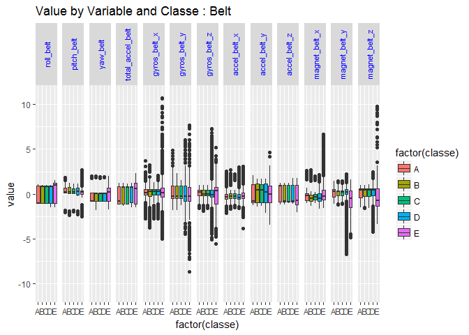
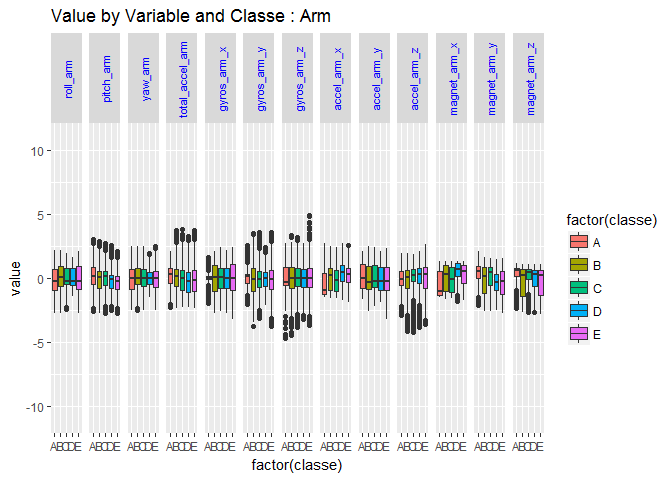
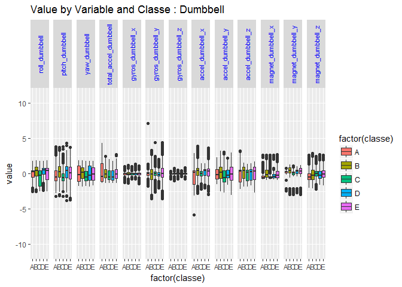
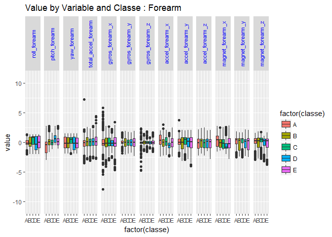
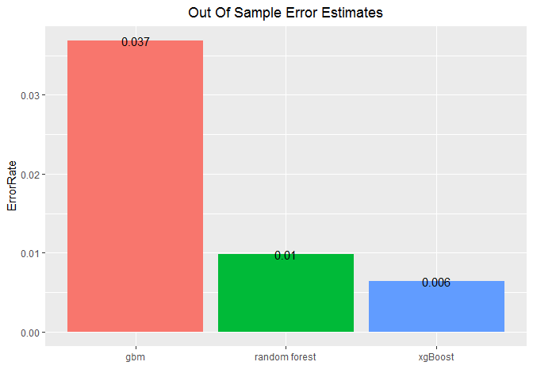

# Exercise Analysis
Charlie LeCrone  
November 25, 2016  


## Just Do It........Well?

Many people talk about how much exercise they do.  However, very little is said concening the quality of that exercise.  In this analysis, I will use sensor data to predict the quality of an exercise.  To do this, I will fit multiple machine learning models to a data set, evaluate the estimated out of sample error for each, and use the top performer to generate predictions on fresh data.


## The Data

The data set was generated by six participants performing standard dumbell lifts in 5 different ways.  Only one of the 5 possible methods was actually the correct form of the exercise.  Data was collected by accelerometers attached to the belt, forearm, upper arm and dumbell.  The data set was generously provided by: http://groupware.les.inf.puc-rio.br/har.  More detailed information about the data is available here:  http://groupware.les.inf.puc-rio.br/har (see the section on the Weight Lifting Exercise Dataset).


## Getting Stated

To begin, I will load the required libraries, the training and testing data sets, and drop variables with too many (> 60%) NA values or no predictive value.


```r
## Get Data

training<-read.csv("C:/Coursera/Practical Machine Learning/practicalmachinelearning/pml-training.csv", na.strings=c("NA", "", "#DIV/0!"))
testing<-read.csv("C:/Coursera/Practical Machine Learning/practicalmachinelearning/pml-testing.csv", na.strings=c("NA", "", "#DIV/0!"))                   

# Drop columns with NA values
training <- training[, colSums(is.na(training)) == 0]
testing <- testing[, colSums(is.na(testing)) == 0]

## Drop non-predictors

training<-training[,8:60]
testing<-testing[,8:60]

dim(training)
```

```
## [1] 19622    53
```

```r
dim(testing)
```

```
## [1] 20 53
```

Next, I will use the caret package's preProcess function to center and scale the remaining numeric variables:


```r
## Center and scale predictors

trc<-training$classe
tec<-testing$problem_id

PreObj<-preProcess(training[,1:52])
t1<-predict(PreObj, training[, 1:52])
t2<-predict(PreObj, testing[, 1:52])

training<-as.data.frame(cbind(t1, classe=as.factor(trc)))
testing<-as.data.frame(cbind(t2, problem_id=tec))
```


## Visual Inspection
What we have at this point is 4 sets of 13 sensor variables and the dependant variable classe.  The four box plots below examine the distribution of values by classe for each of the 13 sensor readings.


```r
## Render plots

fp1
```

<!-- -->

```r
fp2
```

<!-- -->

```r
fp3
```

```
## Warning: Removed 4 rows containing non-finite values (stat_boxplot).
```

<!-- -->

```r
fp4
```

```
## Warning: Removed 3 rows containing non-finite values (stat_boxplot).
```

<!-- -->

## Prepare Training Data for Modeling

My next step is to prepare the training data for model development.  Since we have quite a bit of training data, I will create training, testing, and validation subsets of the training data.


```r
## Create train, test and validation sets from training data

set.seed(1234)
inBuild <- createDataPartition(y=training$classe,p=0.7, list=FALSE)
val <- training[-inBuild,]
buildData <- training[inBuild,]
inTrain <- createDataPartition(y=buildData$classe,p=0.7, list=FALSE)
extrn <- buildData[inTrain,]
extst <- buildData[-inTrain,]
```

Now that I have training, testing, and validation data sets, I will train three different machine learning algorithms availble in the caret package:

 - gbm or generalized boosted regression 
 - random forest 
 - xgboost or extreme gradient boosting
 
I've experienced good results with random forest before, and expect to get the best result with that approach.  Xgboost has gotten a lot of buzz and is newly available in the caret package, so I decided to give that a try as well.

I will use four fold cross-validation in the training control for each model. I'll evaluate each by predicting the on the testing subset of the training data and looking at the confustion matrix for each.  I'll then estimate the out-of-sample error rate by predicting on the validation subset of the training data.


```r
## Model 1 Gradient Boosting

# set.seed(2345)
# fitControl<-trainControl(method="cv", number=4, search = "grid")
# m1 <- train(classe ~ ., method="gbm",data=extrn)
# print(m1$finalModel)
load("C:/Coursera/Practical Machine Learning/practicalmachinelearning/m1.RData")
p1<-predict(m1,extst)
```

```
## Loading required package: gbm
```

```
## Loading required package: survival
```

```
## 
## Attaching package: 'survival'
```

```
## The following object is masked from 'package:caret':
## 
##     cluster
```

```
## Loading required package: splines
```

```
## Loading required package: parallel
```

```
## Loaded gbm 2.1.1
```

```
## Loading required package: plyr
```

```r
confusionMatrix(p1, extst$classe)
```

```
## Confusion Matrix and Statistics
## 
##           Reference
## Prediction    A    B    C    D    E
##          A 1146   26    0    2    3
##          B   16  753   26    1    7
##          C    7   13  684   22    5
##          D    2    4    8  647   10
##          E    0    1    0    3  732
## 
## Overall Statistics
##                                           
##                Accuracy : 0.9621          
##                  95% CI : (0.9558, 0.9677)
##     No Information Rate : 0.2844          
##     P-Value [Acc > NIR] : < 2.2e-16       
##                                           
##                   Kappa : 0.9521          
##  Mcnemar's Test P-Value : 3.342e-05       
## 
## Statistics by Class:
## 
##                      Class: A Class: B Class: C Class: D Class: E
## Sensitivity            0.9787   0.9448   0.9526   0.9585   0.9670
## Specificity            0.9895   0.9849   0.9862   0.9930   0.9988
## Pos Pred Value         0.9737   0.9377   0.9357   0.9642   0.9946
## Neg Pred Value         0.9915   0.9867   0.9900   0.9919   0.9926
## Prevalence             0.2844   0.1935   0.1744   0.1639   0.1838
## Detection Rate         0.2783   0.1829   0.1661   0.1571   0.1778
## Detection Prevalence   0.2858   0.1950   0.1775   0.1629   0.1787
## Balanced Accuracy      0.9841   0.9649   0.9694   0.9758   0.9829
```

```r
## Model 2 Random Forest

# set.seed(3456)
# m2 <- train(classe ~ ., method="rf",data=extrn, trControl = trainControl(method="cv"),number=4)
load("C:/Coursera/Practical Machine Learning/practicalmachinelearning/m2.RData")
p2<-predict(m2,extst)
confusionMatrix(p2, extst$classe)
```

```
## Confusion Matrix and Statistics
## 
##           Reference
## Prediction    A    B    C    D    E
##          A 1170    6    0    0    0
##          B    1  788    5    1    4
##          C    0    3  712    8    1
##          D    0    0    1  666    5
##          E    0    0    0    0  747
## 
## Overall Statistics
##                                           
##                Accuracy : 0.9915          
##                  95% CI : (0.9882, 0.9941)
##     No Information Rate : 0.2844          
##     P-Value [Acc > NIR] : < 2.2e-16       
##                                           
##                   Kappa : 0.9892          
##  Mcnemar's Test P-Value : NA              
## 
## Statistics by Class:
## 
##                      Class: A Class: B Class: C Class: D Class: E
## Sensitivity            0.9991   0.9887   0.9916   0.9867   0.9868
## Specificity            0.9980   0.9967   0.9965   0.9983   1.0000
## Pos Pred Value         0.9949   0.9862   0.9834   0.9911   1.0000
## Neg Pred Value         0.9997   0.9973   0.9982   0.9974   0.9970
## Prevalence             0.2844   0.1935   0.1744   0.1639   0.1838
## Detection Rate         0.2841   0.1914   0.1729   0.1617   0.1814
## Detection Prevalence   0.2856   0.1940   0.1758   0.1632   0.1814
## Balanced Accuracy      0.9986   0.9927   0.9941   0.9925   0.9934
```

```r
## Model 3 Extreme Gradient Boosting

# set.seed(4567)
 trdf<- data.table(extrn, keep.rownames=F)
 tedf<-data.table(extst, keep.rownames = F)
# fitControl<-trainControl(method="cv", number=4, search = "grid")
# m3<-train(classe~., data=trdf, method="xgbLinear", trControl=fitControl)
load("C:/Coursera/Practical Machine Learning/practicalmachinelearning/m3.RData")
p3<-predict(m3, tedf)
confusionMatrix(p3, extst$classe)
```

```
## Confusion Matrix and Statistics
## 
##           Reference
## Prediction    A    B    C    D    E
##          A 1165    2    0    0    0
##          B    6  789    2    0    2
##          C    0    4  715    8    1
##          D    0    0    1  667    1
##          E    0    2    0    0  753
## 
## Overall Statistics
##                                           
##                Accuracy : 0.993           
##                  95% CI : (0.9899, 0.9953)
##     No Information Rate : 0.2844          
##     P-Value [Acc > NIR] : < 2.2e-16       
##                                           
##                   Kappa : 0.9911          
##  Mcnemar's Test P-Value : NA              
## 
## Statistics by Class:
## 
##                      Class: A Class: B Class: C Class: D Class: E
## Sensitivity            0.9949   0.9900   0.9958   0.9881   0.9947
## Specificity            0.9993   0.9970   0.9962   0.9994   0.9994
## Pos Pred Value         0.9983   0.9875   0.9821   0.9970   0.9974
## Neg Pred Value         0.9980   0.9976   0.9991   0.9977   0.9988
## Prevalence             0.2844   0.1935   0.1744   0.1639   0.1838
## Detection Rate         0.2829   0.1916   0.1736   0.1620   0.1829
## Detection Prevalence   0.2834   0.1940   0.1768   0.1625   0.1833
## Balanced Accuracy      0.9971   0.9935   0.9960   0.9938   0.9971
```

```r
## Evaluate Models on Validation Set

p1val<-predict(m1, val)
cm1<-confusionMatrix(p1val, val$classe)

p2val<-predict(m2, val)
cm2<-confusionMatrix(p2val, val$classe)

p3val<-predict(m3, val)
cm3<-confusionMatrix(p3val, val$classe)


## Get model accuracy

error<-as.data.frame(as.numeric(cbind((1-cm1$overall["Accuracy"]), (1-cm2$overall["Accuracy"]), (1-cm3$overall["Accuracy"]))))
names(error)<-"ErrorRate"
Model<-c("gbm", "random forest", "xgBoost")
error<-as.data.frame(cbind(Model, error))

## Out of sample error rate by model

EP<-ggplot(error, aes(x = factor(Model), y = ErrorRate, fill=factor(Model))) + geom_bar(stat = "identity") + geom_text(label=round(error$ErrorRate, 3))+xlab("")+ theme(legend.position="none")
EP<-EP+ggtitle("Out Of Sample Error Estimates")+theme(plot.title = element_text(hjust = 0.5))
EP
```

<!-- -->

## Conclusion

All three models have very low out of sample error estimates.  Surprsingly, the xgBoost model edged out random forest for the lowest error estimate.  All three return the same predictions on the testing data, which scored 20 out of 20 when submitted to Coursera.


```r
## Predict on Testing Data
FPred1<-predict(m1, testing)
FPred2<-predict(m2, testing)
Fpred3<-predict(m3, testing)

# gbm 
FPred1
```

```
##  [1] B A B A A E D B A A B C B A E E A B B B
## Levels: A B C D E
```

```r
# random forest
FPred2
```

```
##  [1] B A B A A E D B A A B C B A E E A B B B
## Levels: A B C D E
```

```r
# xgBoost
Fpred3
```

```
##  [1] B A B A A E D B A A B C B A E E A B B B
## Levels: A B C D E
```


